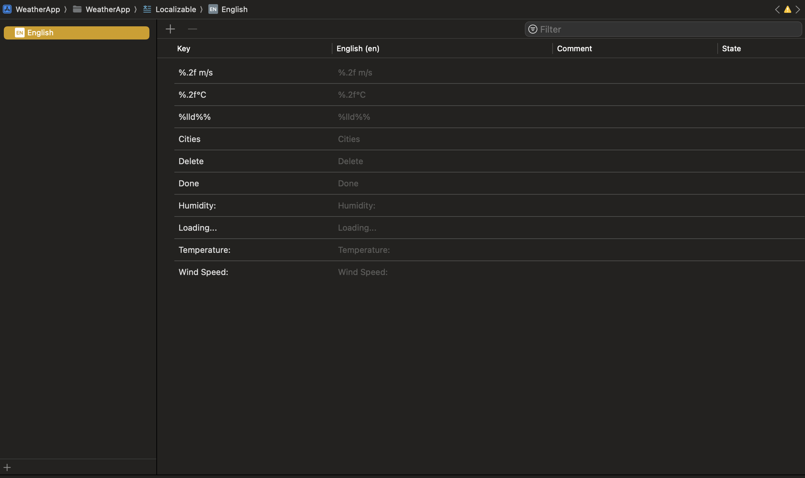

# Weather App

## Overview

The Weather App is an iOS application developed using SwiftUI and the MVVM (Model-View-ViewModel) architecture. It provides users with weather information for various cities, including current weather conditions and forecasts. The app allows users to add cities, view their weather details, and see their weather history.

## Features

- Add, Delete, and Update cities to see their weather conditions.
- View detailed weather information, including temperature, humidity, and wind speed.
- Displays a historical log of weather data for added cities.
- Handles network connectivity changes gracefully.
- Uses modern Swift features including async/await for network calls which cames from backend using objective c 'Network Layer'

## Architecture

The app is structured using the MVVM architecture to separate concerns and improve testability:

- **Model**: Represents the weather data and city information.
- **View**: SwiftUI views to display the UI.
- **ViewModel**: Handles the business logic and provides data to the views using a Repository design pattern.
- **Repository**

## Installation

1. Clone the repository:
   ```bash
   git clone https://github.com/Ahmed-Elsman/WeatherApp.git
   cd WeatherApp

2. Open the project in Xcode:
   ```bash
   open WeatherApp.xcodeproj

3. Build and run the project on a simulator or a physical device.

## Demo


## Usage

- Launch the app to see an empty list with a no-data view that tells you to add a new city.
- Click on the plus button in the top right of the view and enter the city name in the alert view.
- Tap on a city to view its details.
- Press back and click on the info button to see the historical city weather.
- Feel free to swipe the city cell so you can delete the pre-saved city.

## Code Structure

### View Models
- **CitiesViewModel**: Fetches and provides cities data that are saved locally and added by the user.
- **CityDetailViewModel**: Fetches and provides city weather for a specific city.
- **WeatherHistoryViewModel**: Fetches and provides historical requests for weather-related to specific city.

### Views
- **CitiesView**: Contains a list of pre-saved cities.
- **CityDetailView**: Displays city details from two ways (backend or from saved core data).
- **WeatherHistoryView**: Displays a list of historical requests for city weather.

### Networking (Obj-C)
- **NetworkManaging**: Protocol defining methods for network requests.
- **NetworkManager**: Implementation of `NetworkManaging` using `URLSession`.

### Models
- **City**: Represents a city.
- **CityDAO**: Represents a city (Data Access Object).
- **Coord**: Represents a coord.
- **CoordDAO**: Represents a coord (Data Access Object).
- **Wind**: Represents a wind.
- **WindDAO**: Represents a wind (Data Access Object).
- **Main**: Represents a main.
- **MainDAO**: Represents a main (Data Access Object).
- **Weather**: Represents a weather.
- **WeatherDAO**: Represents weather (Data Access Object).

## Localization

The project is open for localization with adding multiple languages using String Catalogs, we are now supporting:

- English

we can add more languages from here just click on the plus icon (+) and select the language




## Testing

The project includes unit tests to ensure the functionality of view models and network operations. To run the tests:

1. Open the project in Xcode.
2. Select the `WeatherApp` scheme.
3. Press `Cmd + U` to run the tests.

## Things should be done if more time

- Converting **Common** & **DAL** folders to be as separated packages.
- Making Modularization in the app.
- Make view models using ViewModelStates (Loading, Loaded, Error).
- Enhance UI to fit UI_Specs.
- More Unit test cases.
- Use SnapshotTests.
- SwiftLint.
  
## Acknowledgements

- OpenWeatherMap API for providing weather data.
- Apple for the SwiftUI framework.

## Info

Name: Ahmed Elsman

Email: ahmedelsman0@gmail.com

Thanks Hope to hear from you soon.

